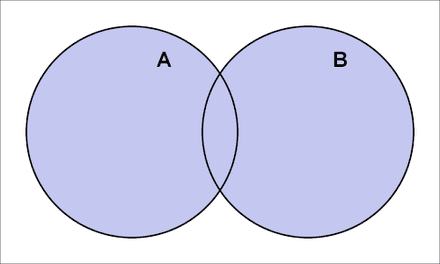
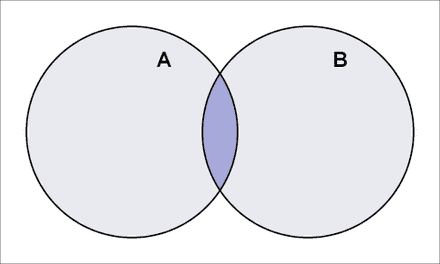

# 交叉类型

交叉类型是 TS 对类型做纵向扩展的一种方式，它可将多个类型合并在一个类型上，让类型的能力更为丰富。

```typescript
interface Element {
  width: number
  height: number
}

interface Media {
  src: string
}

type Image = Element & Media
//{
//  width: number;
//  height: number;
//  src: string;
//}
```

交叉类型就像集合中的并集，将其他集合中的元素全都合并到一处。



但使用交叉类型时，需要注意属性的类型不能有冲突，否则合并后就会成为 never 类型。

```typescript
type T0 = string & boolean // T0 变为了 never
```

# 联合类型

联合类型是 TS 对类型做横向扩展的一种方式，这赋予了类型更多的可能性。

```typescript
interface Audio {
  src: string
  autoplay: boolean
}

interface Video {
  src: string
  autoplay: boolean
  width: number
  height: number
}

type Media = Audio | Video
//{
//  src: string;
//  autoplay: boolean;
//}
```

联合类型对应到集合中的概念就是交集。所以在类型联合之后，如果不收窄为更具体的类型的话，那么该联合类型只会具有之前类型的公共属性。



## 可识别的联合类型

由于联合类型一般都是联合一些复杂的类型，所以 TS 推出了可识别联合类型，用来收窄联合类型。
原理是在联合类型的每个单独类型上，都具有一个同名不同值的单例类型。TS 可以通过这个单例类型来收窄类型。

```typescript
type Square = {
  kind: 'square'
  size: number
}

type Rectangle = {
  kind: 'rectangle'
  width: number
  height: number
}

type Circle = {
  kind: 'circle'
  radius: number
}

type Shape = Square | Rectangle | Circle

function area(shape: Shape): number {
  switch (shape.kind) {
    case 'square':
      return shape.size * shape.size
    case 'rectangle':
      return shape.width * shape.height
    case 'circle':
      return Math.PI * shape.radius * shape.radius
  }
}
```

当然如果组成联合类型的每个类型中都有一个特殊的属性，那么也可以通过 `in` 来进行类型收窄。

```typescript
type Square = {
  kind: 'square'
  size: number
  square: any
}

type Rectangle = {
  kind: 'rectangle'
  width: number
  height: number
  rectangle: any
}

type Circle = {
  kind: 'circle'
  radius: number
  circle: any
}

type Shape = Square | Rectangle | Circle

function area(shape: Shape): number {
  if ('square' in shape) {
    return shape.size * shape.size
  } else if ('rectangle' in shape) {
    return shape.width * shape.height
  } else if ('circle' in shape) {
    return Math.PI * shape.radius * shape.radius
  } else {
    // ...
  }
}
```

# 索引类型

索引类型是 TS 中访问类型索引的一种方式，索引类型有两个部分：

- 索引查询操作符: `keyof T`
- 索引访问操作副符: `T[K]`

```typescript
function pluck<T, K extends keyof T>(o: T, propertyNames: K[]): T[K][] {
  return propertyNames.map((n) => o[n])
}

interface Car {
  manufacturer: string
  model: string
  year: number
}
let taxi: Car = {
  manufacturer: 'Toyota',
  model: 'Camry',
  year: 2014,
}

let makeAndModel: string[] = pluck(taxi, ['manufacturer', 'model'])
let modelYear = pluck(taxi, ['model', 'year'])
```

# 映射类型

如果你在 TS 中看到了这样的写法`[K in T]`，那就是使用到了映射类型。鉴别的方式很简单，就是`in`这个关键字。因为映射类型使用了与 `for .. in` 类型的语法。

在 TS 的工具类型中，有一个 Readonly 类型，它可以将给定类型的第一层属性都加上 `readonly` 修饰符, 它的实现方式是这样的：

```typescript
type Readonly<T> = {
  readonly [P in keyof T]: T[P]
}
```

我们看索引类型签名这部分`[P in keyof T]`, `keyof T` 之前说过它是索引访问操作符，他可以将 T 的 key 都抽出来变成联合类型。

```typescript
interface Box {
  width: number
  height: number
}

type T0 = keyof Box // T0 = "width" | "height"
```

`[P in X]` 就是类似于`for .. in` 的语法， TS 声明了一个临时的类型名称 P，循环将 X 的每一个值都赋予 P。之后索引签名前加上`readonly`修饰符，再使用索引访问操作符`T[P]`获取到具体的类型。从而实现了 Readonly 的功能。

> Readonly 只能将类型的第一层属性都设置为只读属性。如果你有一个具有多层属性的类型，那么最快将其变为 Immutable 的方式就是 const contenxt。它的语法与类型断言十分相似，只不过不用声明具体的类型，声明为 const 就可以。let O = {
> a: {

    b: {
      c: "d",
    },

},
} as const;

O.a.b.c = "1"; // Error!

TS 的工具类型中，还有很多使用映射类型实现的工具类型。 感兴趣的话可以翻看[源码](https://github.com/microsoft/TypeScript/blob/eac073894b172ec719ca7f28b0b94fc6e6e7d4cf/lib/lib.es5.d.ts#L1441)

```typescript
type Partial<T> = {
  [P in keyof T]?: T[P]
}

type Nullable<T> = {
  [P in keyof T]: T[P] | null
}

type Record<K extends keyof any, T> = {
  [P in K]: T
}

type Required<T> = {
  [P in keyof T]-?: T[P]
}

type Pick<T, K extends keyof T> = {
  [P in K]: T[P]
}
```

# 条件类型

我们在 coding 的时候，经常会遇到这样的问题：

```typescript
function fun(arg: any): String | Number {
  if (typeof arg === 'string') {
    return new String('hello')
  }
  return Number(0)
}

const result = fun('a')
```

`fun`函数根据不同的条件，返回不同的结果。但是 result 的类型是 `String ｜ Number`， 而不是 String 或 Number 中的一个。这种情况下 result 只能访问到 String 和 Number 的公共属性。这显然不是我们想要的结果。

这时候就需要条件类型上场了。

```typescript
function fun<T>(arg: T): T extends string ? string : number {
  if (typeof arg === 'string') {
    return 'hello'
  } else {
    return 1024
  }
}

const r1 = fun('a') // string

const r2 = fun(1) // number
```

条件类型的语法是：`T extends U ? X : Y`。 而且当 T 为联合类型时，条件类型也可以展开：

```typescript
(A | B) extends U ? X : Y ==> (A extends U ? X : Y) | (B extends U ? X : Y)
```

TS 内置的工具类型，也有一些使用条件类型实现的：

```typescript
type Exclude<T, U> = T extends U ? never : T

type Extract<T, U> = T extends U ? T : never

type NonNullable<T> = T extends null | undefined ? never : T
```

# infer 类型延迟推断

`infer` 可以延迟类型推断，在使用到的时候再去推断具体的类型，但是 `infer` 必须跟在 `extends` 关键字后面。

```typescript
/**
 * Obtain the return type of a function type
 */
type ReturnType<T extends (...args: any) => any> = T extends (
  ...args: any
) => infer R
  ? R
  : any

/**
 * Obtain the return type of a constructor function type
 */
type InstanceType<T extends new (...args: any) => any> = T extends new (
  ...args: any
) => infer R
  ? R
  : any
```
