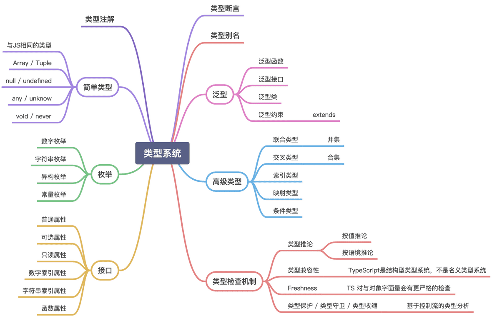

TypeScript 是 JavaScript 的超集，它提供的静态类型检查机制，可以让我们提早发现代码中隐藏的问题。TS 去除了 JS 的部分糟粕，例如： `0 == '0'`、`1 == true` 和 `0 == false`。 TS 紧跟 ES 的最新版本，提供了很多 ES 的新特性支持, 例如 3.8 版本中加入的 `optional chaining` 和 `nullish coalescing`。 而且使用 TS 可以具有更好的代码自动补全、更智能的自动重构。



# 类型注解

类型注解是 TS 中声明变量类型的基本语法，主要由变量名后的冒号和类型表达式两部分组成。

```typescript
let variable: typeExpression = value
```

# 简单类型

TS 为了实现从 JS 的无痛一键切换，TS 中的数据类型包含了 JS 中的数据类型, 而且还增加了多个扩展类型。

```typescript
// Number
let num: number = 10 // 十进制
let binaryNumber: number = 0b1101 // 二进制
let octNumber: number = 0o123 // 八进制
let hexNumber: number = 0xf00d // 十六进制

// Boolean
let canRun: boolean = false

// String
let str: string = 'Hello World!'
let tpl: string = `Hello ${moto}`

// Symbol
let sym: symbol = Symbol()
let sym1: symbol = Symbol.for('symbol')

// Array
let arr: number[] = [1, 2, 3]
let arr1: Array<number> = [1, 1]

// Tuple - 元祖就是不支持跨界访问的数组
let tuple: [string, number] = ['hello', 123]
// TS 3.0 之后，Tuple支持尾部的可选成员
let tuple1: [number, string, boolean?] = [5, 'A']

// Object literal
let obj1: Object = { name: 'iwfan' }
let obj2: { name?: string } = { name: 'iwfan' }

// null 与 undefined
/*
  默认情况下 null / undefined是所有类型的子类型，
  也就是说 null / undefined 类型的变量可以赋予他们任何类型的值。 
  但是如果开启了 --strictNullChecks 这个编译器选项，
  null / undefined类型的变量就只能赋值为 any 类型 或者他们各自类型的变量了。
*/

// any / unknown
// any 与 unknown 都表示跳过类型检查，但 any 可以随意赋值，随意取值。unknown 随意赋值，但却不能随意取值

let any: any = {}
any.a // OK!

let unknow: unknown = {}
unknown.a // Error!

// void 表示没有类型， 一般用在没有返回值的函数上
function noReturnFunc(): void {}

// never - 表示永远不存在值的类型。
// 返回never的函数必须存在无法达到的终点
function infiniteLoop(): never {
  while (true) {}
}
function error(message: string): never {
  throw new Error(message)
}
```

# 枚举

在其他语言中、枚举是表示常量的常用方式。虽然 JS 没有这个原生特性，但在 TS 中可以很方便的使用枚举。

## 数字枚举

数字枚举就是常量值为数字的枚举，TS 默认使用的就是数字枚举，数字枚举的值从 0 开始，每增加一个枚举，其值就会从前一个的值 +1。TS 也支持指定值，但要注意值的重复。

```typescript
enum Color {
  Red,
  Blue,
  Yellow,
}
// Don't do this, PURPLE = 3.
enum Color {
  Red = 1,
  Blue = 3,
  Yellow = 2,
  PURPLE,
}
```

数字枚举有一个非常好用的特性就是反向映射, 即可以用常量名查询值，也可以用常量值查询常量名。

```typescript
Color.Red = 0
Color[0] = 'Red'
```

实现这个特性的原理也非常简单，其实就是在枚举对象上将`名 -> 值`的映射和`值 -> 名`的映射都定义了一遍。可以参看下面经过 TS 编译过后 JS 代码。

```typescript
var Color
;(function (Color) {
  Color[(Color['Red'] = 0)] = 'Red'
})(Color || (Color = {}))
```

## 字符串枚举和异构枚举

字符串枚举与数字枚举类似，就是值为字符串的枚举。但是 TS 中字符串枚举不支持反向映射。
异构枚举是指字符串枚举和数字枚举的混用形式。

```typescript
// 字符串枚举 - 无法进行反向映射
enum Week {
  Mon = 'mon',
}

// 异构枚举 - 字符串和数字枚举的混用
enum Test {
  Foo,
  Bar = 'bar',
}
```

## 关于枚举成员

TS 中将枚举成员分为两大类，一类是常量枚举成员 - 没有默认值的枚举成员、引用已有枚举的枚举成员和常量表达式枚举成员。这类枚举成员的值在编译时就可以确定。第二类就是计算枚举成员，此类枚举成员的值都是需要运行时计算才能确定的，所以 TS 在编译时无法计算出具体的值，只会原样将代码输出到编译结果中。

```typescript
enum Color {
  Red,
}
let str = 'Hello'
enum T {
  A,
  B = Color.Red,
  C = '1' + '2',
  D = str.length,
}
```

如上例中的 A、B、C 都是常量枚举成员，而 D 属于计算枚举成员。但是在实际项目中，严重不建议使用计算枚举成员，因为枚举是表示有限序列的集合。使用计算枚举会导致枚举值的不确定性，这与枚举表示常量值的惯性思维所违背。

# 接口与类型别名

接口一般用于表示新的结构化的复杂类型。

```typescript
// 对象类型接口
interface Person {
  name: string
  age?: number // 可选属性
  readonly sex: boolean // 只读属性
  [index: number]: any // 数字索引属性
  [propName: string]: any // 字符串索引属性
  say(smt: string): void // 函数属性
}

// 函数类型接口
interface Func {
  (s: string): number
}

let f: Func = (s: string) => 2
```

而类型别名和 interface 很相似。

```typescript
type Person = {
  name: string
  age?: number // 可选属性
  readonly sex: boolean // 只读属性
  [index: number]: any // 数字索引属性
  [propName: string]: any // 字符串索引属性
  say(smt: string): void // 函数属性
}
```

简要区别：接口会生成新的类型，而类型别名不会生成新类型。类型别名可以表示由现有类型衍生出来的类型，例如 TS 中的工具类型 `Required` 、`Readonly` 等都是由类型别名定义的。

关于接口与类型别名的具体区别可以查看文档: [interfaces-vs-type-aliases](https://www.typescriptlang.org/docs/handbook/advanced-types.html#interfaces-vs-type-aliases)。

# 类

class 是在 ES6 中引入的概念，但其实 ES6 中的 class 只是一个 syntax sugar, 本质还是用 function 实现的构造函数 `typeof class p {} === 'function'`，再加以原型链共享属性就成了现在的 class。但是 ES6 中的 class 有一个不同，那就是静态属性的继承，ES6 中使用 `extends` 关键字继承的子类，天然的继承了父类的静态属性。而在没有 extends 关键字的时期，这是必须要特殊处理的。 实现静态属性继承的方式还是使用的原型链。感兴趣的朋友可以仔细研究一下。TS 中 class 的语法和 ES6 中的相同，但是增加了一些新的语法。（TS 发布的新版中已经支持了 ES 私有属性的提案，虽然这个#写法很丑，但是这也体现了使用 TS 的一大好处，你总能体验到新的东西。

由于类类型的存在， TS 也具有了多态的特性。

## 属性修饰符

TS 中增加了和 Java 中类似的访问修饰符，但是 TS 中没有 default 的修饰符，TS 的 default 就是 `public。` 且在构造函数的参数上添加修饰符的话，该属性会被添加到该类的实例属性中（无需在类中声明。

- `public` - 不限制访问。
- `private` - 只能在本类中访问， 修饰构造函数的话，该类不能被继承、不能被实例化。
- `protected` - 本类与子类， 修饰构造函数的话， 该类只能被继承，不能被实例化
- `static` - 修饰静态属性、可以被继承 (**被静态属性修饰的属性不能使用泛型**)
- `abstract` - 修饰类，类不可以被实例化，修饰属性、属性需要被子类实现。

# 泛型

TS 中支持了泛型，泛型可以让静态类型具有更高的灵活性。

```typescript
// 泛型函数
function fun<T>(t: T): T {
  return t
}

// 泛型接口
// 泛型默认值
interface List<T = Person> {
  data: T[]
}

// 泛型类
class List<T> {
  static test(t: T) {} // Error! 类的静态成员不受泛型约束
}
```

## 泛型约束

泛型约束可以将泛型收窄为具有某些特性的类型。

```typescript
interface Lengthwise {
  length: number
}

// 泛型约束，将 T 类型约束为具有 length 属性的类型
function loggingIdentity<T extends Lengthwise>(arg: T): T {
  console.log(arg.length) // Now we know it has a .length property, so no more error
  return arg
}
```

泛型约束可以配合 TS 的高级类型，实现一些更高级的功能，我们后续再讲。
