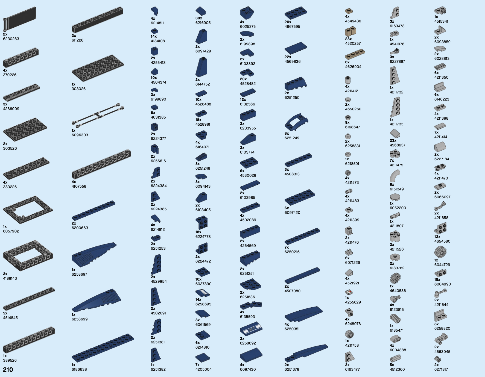
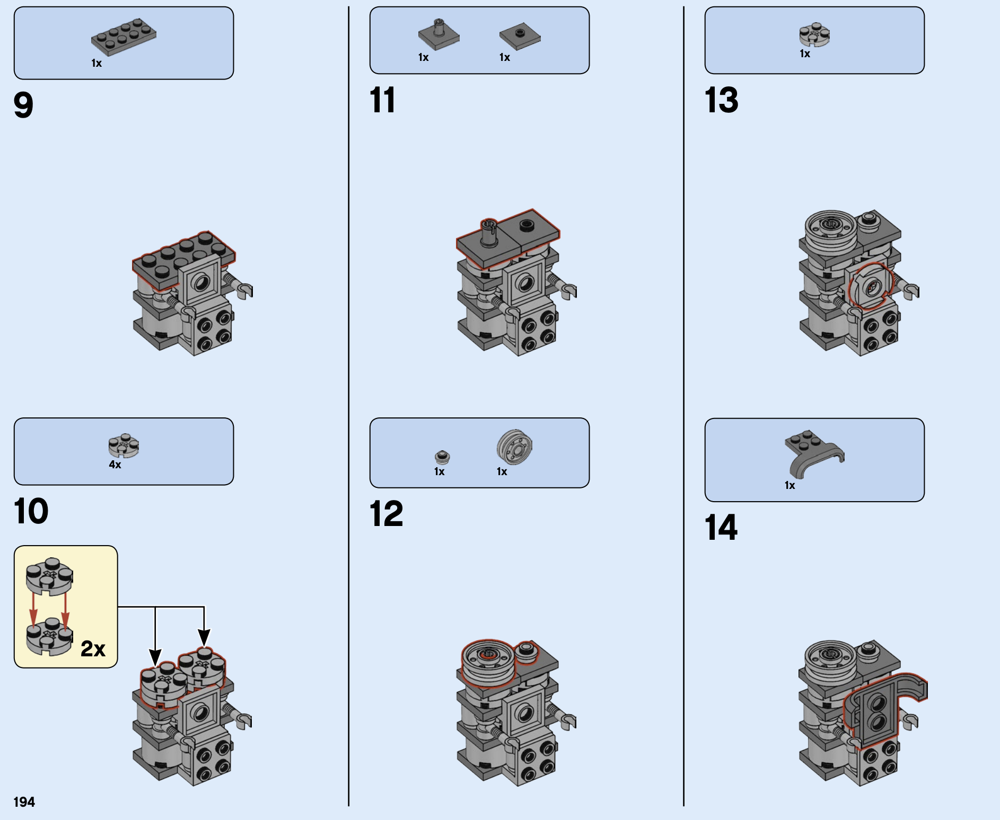
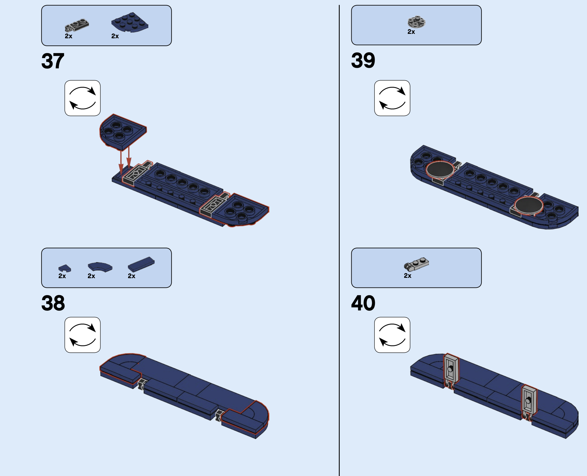
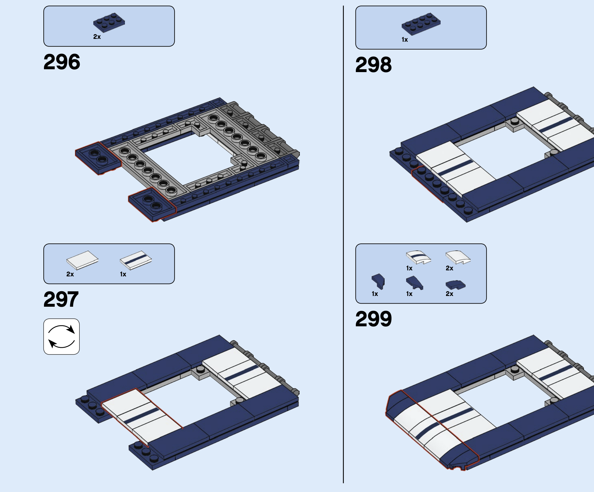

# Functional Programming in JavaScript

如何使用函数式编程拼乐高


---

# What

* 函数式编程是一种思维方式，也是一种编写程序的方式。
* 函数式编程是一种通过应用与组合函数来构造程序的开发风格。
* 函数式编程的目标是使用函数来抽象作用在数据之上的控制流与操作，从而在系统中消除副作用并减少对状态的改变。

---
# Why

---
## Example

```javascript
function showStudent(ssn) {
  var student = db.get(ssn)
  if (student !== null) {
    document.querySelector(`#${elementId}`).innerHTML =
      `${student.ssn}, ${student.firstname}, ${student.lastname}`
  } else {
    throw new Error('Student not found!')
  }
}

showStudent('444-44-4444')
```

---
```javascript
const find = curry((db, id) => {
  const student = db.get(id)
  if (student === null)
    throw new Error(`Student not found!`)
  return student
})

const csv = (student) => `${student.name}, ${student.firstname},${student.lastname}`

const append = curry((selector, content) => {
  document.querySelector(selector).innerHTML = content
})

const showStudent = compose(
  append('#student-info'),
  csv,
  find(db)
)

showStudent('444-44-4444')
```

---

# Foundation

* 声明式编程风格
* 纯函数
* 引用透明
* 柯里化
* 函数组合
* 状态不可变 
* ...

---
## 命令式编程 - 基础人机交互

- 命令式编程很具体的告诉计算机如何执行某个任务，更关注与解决问题的步骤。

```javascript
var array = [0, 1, 2, 3, 4, 5]

for (var i = 0; i < array.length; i++) {
  array[i] = Math.pow(array[i], 2)
}

array; //-> [0, 1, 4, 9, 16, 25]
```

---
## 声明式编程 


- 声明式编程将程序逻辑与求值分离开来，更关注与如何用表达式描述程序逻辑，而不一定要说明程序状态的变化。

```javascript
const array = [0, 1, 2, 3, 4, 5]

const newArray = map(array, num => Math.pow(num, 2))
```

---
## 纯函数 - 基础单元



1. 函数的输出仅取决于函数的输入，而不依赖于任何在函数求值期间或调用间隔时可能变化的隐藏状态和外部状态。 

```javascript
const greet1 = (name) => `Hi, ${name}`
greet1('Brianne') // 'Hi, Brianne'


window.name = 'Brianne'
const greet2 = () => `Hi, ${window.name}`
greet2() // "Hi, Brianne"

```

---
## 纯函数 - 基础单元


2. 函数不会造成超出其作用域的变化，例如修改全局对象或引用传递的参数。

```javascript
let greeting

const greet = (name) => {
  greeting = `Hi, ${name}`
}

greet('Brianne')
greeting // "Hi, Brianne"
```

---
## 纯函数

* `Date.now()` ?
* `Math.random()` ?

---
### 柯里化 Currying

f(a, b, c)

* f(a) -> f(b, c) -> !
* f(a, b) -> f(c) -> !
* f(a, b, c) -> !

---
### 函数组合
- compose: `compose(f, g) = f(g(x))`
```javascript
const showStudent = compose(
  append('#student-info'),
  csv,
  find(db)
)
```



---
### 函数组合
- alt: `alt(f, g) = f(x) || g(x)`
```javascript
const showStudent = compose(
  append('#student-info'),
  csv,
  alt(find(db), createNewStudent)
)
```



---
### 函数组合
- seq:  `seq(f, g) = f(x), g(x)`
```javascript
const showStudent = compose(
  seq(
    append('#student-info'),
    consoleLog
  ),
  csv,
  find(db)
)
```



---
# Why

* 声明式编程更关注表达程序逻辑
* 促使将任务分解成简单的函数
* 函数的功能更小、更容易复用代码
* 纯函数使得代码更容易测试


---
# EOF
