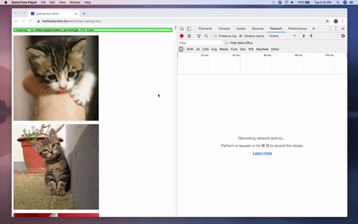
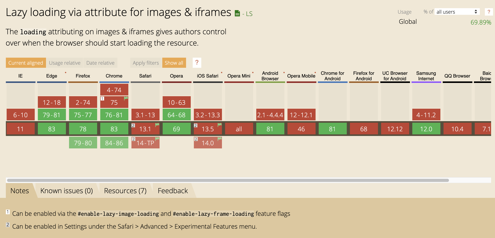

# 浏览器级别的图像延迟加载

Chrome 76 对 img 元素增加了一个 `loading` 属性, 这让浏览器有了内置的图像延迟加载的功能。



## 为什么需要浏览器级别的懒加载呢？

由于图片是网站中请求最多的资源类型, 且图片相对于其他资源来说会占据更多的带宽。在图片较多的网站中，或网络较慢的情况下，若没有懒加载，页面加载速度很慢，用户体验是很差的。

在没有 `loading` 属性之前, 有两种方法可以实现图片懒加载。

- 使用 [IntersectionObserver](https://developers.google.com/web/updates/2016/04/intersectionobserver)
- 使用 `scroll` 、`resize` 或 `orientationchange` 等事件处理程序

但这些都需要开发人员编写额外的代码来做处理。

## 关于 loading 属性

目前，Chrome 会根据图像所在视口位置的不同，选择以不同的优先级加载图像。虽然视口下方的图片以低优先级来加载，但是 Chrome 还是会尽快的获取图像资源。

Chrome76+中， 可以对 img 元素使用 `loading` 属性来完全推迟对图像资源的获取。

loading 属性支持以下三个属性值：

- `auto`： 默认值，与不写无异。(在规范中也没有提到该值，只是在 Chromium 中可用，所以不要使用它)
- `lazy`: 将资源的加载推迟到到达视口的计算距离为止。
- `eager`: 立即加载资源，而不管其在页面上的位置。

## 距离阈值

Chrome 是通过判断图像元素与浏览器视口底部的距离阈值来加载图像的，但这个阈值并是不固定的, 主要取决于几个因素：

- 正在获取的图像资源的类型
- 是否在 Android 版 Chrome 上启用了[精简模式](https://blog.chromium.org/2019/04/data-saver-is-now-lite-mode.html)
- [有效的连接类型](https://googlechrome.github.io/samples/network-information/)

截至 2020 年 7 月，Chrome 进行了重大改进，以对齐本地图像的延迟加载视距距离阈值，从而更好地满足开发人员的期望。

在快速连接（例如 4G）上，Chrome 的视口的距离阈值从`3000px` 降低为 `1250px`；在较慢的连接（例如 3G）上，将阈值从`4000px`更改为`2500px`。此更改实现了两件事：

- `` 行为更接近 JavaScript 延迟加载库提供的体验。
- 新的视距距离阈值仍使我们能够保证在用户滚动到图像时可能已加载图像。

下面的图片展示了一个旧的与新的视距距离阈值之间的比较：


以及新的阈值与 LazySizes（流行的 JS 延迟加载库）的比较：


## 图片大小的设置

在浏览器加载图像时，除非默认给图像设置了宽度与高度，否则在图像被请求回来之前，浏览器是不会知道图片的具体大小的。

这会导致的一个问题是，若没有设置图像的大小，浏览器一开始就不会为图像保留足够的空间。在图像被请求回来之后，很可能发生[布局偏移](https://web.dev/cls)。

所以最好在 img 标签中设置图像的大小，这也是一项编写 html 的最佳实践。

```html

```

## 兼容性

目前，该功能只适用于大多数流行的 Chromium 驱动的浏览器（Chrome，Edge，Opera）和 Firefox， Safair 暂时还不支持。



为了让还不支持懒加载的浏览器支持该功能, 我们可以通过使用 IntersectionObserver API 来模拟该行为。

## IntersectionObserver Web API

IntersectionObserver 提供了一种监听目标元素与祖先元素或是文档视口相交的方法。它可以用于：

- 滚动页面时延迟加载图像或其他内容
- 页面"无限滚动", 从而无需翻页操作
- 报告广告的可见度，从而计算广告收入
- 根据用户是否看到结果来决定是否执行任务或动画处理

### 101

```javascript
const options = {
  root: document.querySelector('#scrollArea'),
  rootMargin: '0px',
  threshold: 1.0,
}

const observer = new IntersectionObserver(callback, options)

const target = document.querySelector('#listItem')
observer.observe(target)
```

如上述代码示例， `IntersectionObserver` 构造函数接收的第一个参数就是事件监听的回掉函数，第二个参数是一个配置项：

- `root`: 根元素，目标元素可滚动的父元素，如果未指定或设置为 null, 则默认为文档视口。
- `rootMargin`: 根元素的 margin 值， 与 CSS margin 取值相同，但并不会设置到元素上。只是在计算相交时，会将该值也计算进去。
- `threshold`: 相交阈值，取值为数字或数字数组(0 ~ 1)。表示在相交到何种程度去调用回掉函数。默认值为 0（意味着即使看到一个像素，回调也将运行）

之后将该 Observer 关联到对应的节点上就 OK 了。

## 实现懒加载

最简单的懒加载实现，假设有如下页面：

```html
<style>
  main {
    box-sizing: border-box;
    margin: 50px;
    height: calc(100vh - 100px);
    border: 2px solid red;
    overflow: auto;
  }
  img {
    margin: 100px;
  }
</style>
<main>
  
  
  
  
  
</main>
```

最简单的懒加载如下：

```javascript
function lazyLoadImage() {
  const onVisible = (entries, observer) => {
    entries.forEach((entry) => {
      const { target, isIntersecting } = entry
      if (isIntersecting) {
        // 判断图片在可见范围内
        const isLoading = target.classList.contains('loading')

        if (!isLoading) {
          // 减少重复加载
          target.classList.add('loading')
          const src = target.dataset.src

          const buffer = new Image() // 构建 Image 对象，发起资源获取的请求
          buffer.onload = () => {
            target.src = src
          }
          buffer.src = src
        }
      }
    })
  }

  const observer = new IntersectionObserver(onVisible, {
    root: document.querySelector('main'),
    rootMargin: '0px 0px 100px 0px',
    threshold: 0,
  })

  const imageList = document.querySelectorAll('img.lazy')
  imageList.forEach((img) => {
    observer.observe(img)
  })
}

// if (!('loading' in HTMLImageElement.prototype)) {
lazyLoadImage()
// }
```

参考链接：
[Native image lazy-loading for the web](https://web.dev/native-lazy-loading/#improved-data-savings-and-distance-from-viewport-thresholds)
[IntersectionObserver’s Coming into View](https://developers.google.com/web/updates/2016/04/intersectionobserver)
