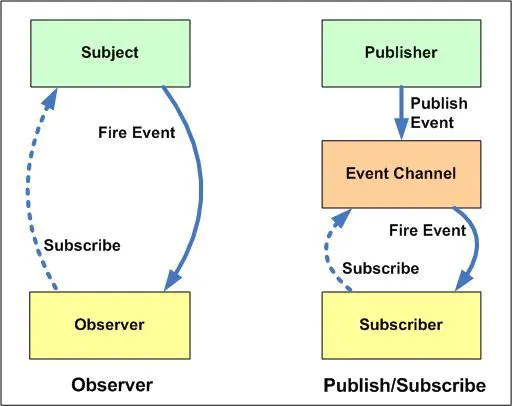

1. 观察者模式中，Observer 与 Subject 的关系是紧耦合的, Observer 中调用 Subject 中的方法为 Subject 添加 observer， Subject 中保存所有 observer，当 Subject 状态发生变更，就回通知所有的 observer 。 观察者模式大多数时候是同步的，比如当事件触发，Subject 就会去调用观察者的方法。

2. 发布订阅模式中，发布者与订阅者的关系是松耦合的。消息并不是由发布者直接发送给订阅者，而是发给了中间层，也就是图中的 Event Channel。再由 Event
Channel 推送给订阅者。 发布者不知道有多少个订阅者，只负责推送消息给 Channel。而订阅者全都被记录在 Channel 中。发布-订阅模式大多数时候是异步的（使用消息队列）。

原文链接：[https://hackernoon.com/observer-vs-pub-sub-pattern-50d3b27f838c](https://hackernoon.com/observer-vs-pub-sub-pattern-50d3b27f838c)
