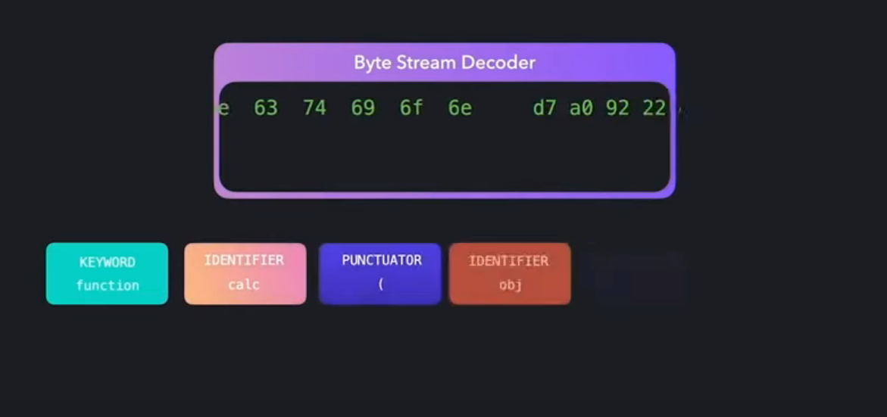
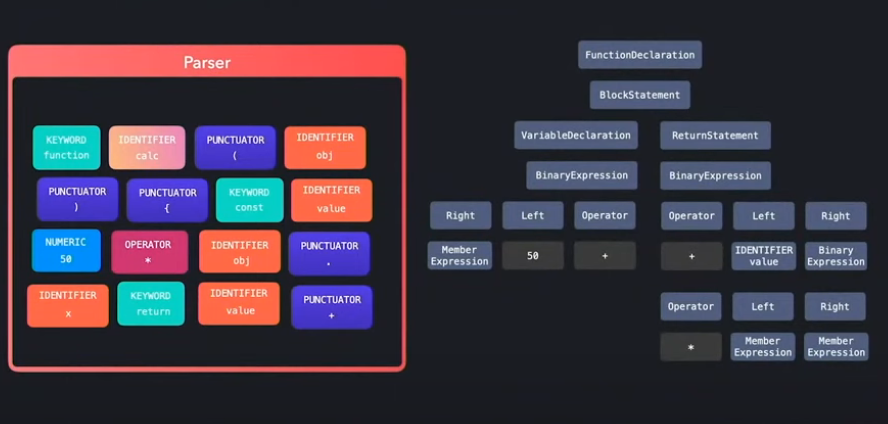
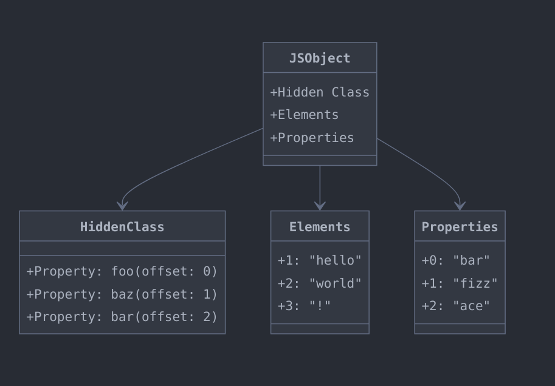
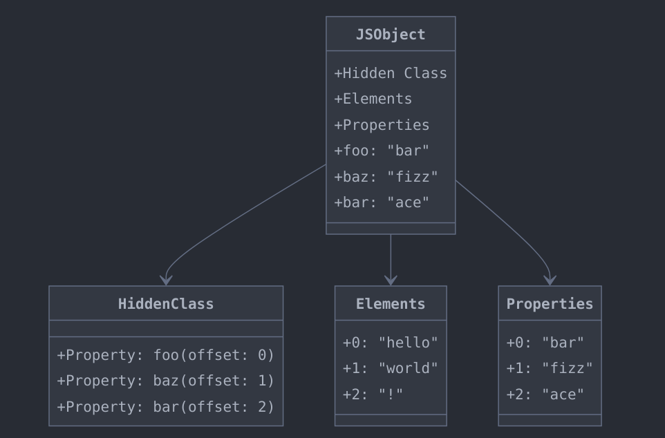

#### 第一问：Chromium 浏览器是如何与 V8 引擎配合解析并执行 JavaScript 代码的？

1. 基于 Chromium 的浏览器内部集成了 V8 引擎，并给 V8 引擎提供了一个安全的执行环境，浏览器在解析 Script 标签、加载 JavaScript 脚本代码时，会将 JavaScript 代码交给 V8 引擎来执行。
2. 浏览器也提供了给 JavaScript 调用的 WEB API， 例如 DOM API、Storage API、Location API 等等， V8 引擎会通过这些 API 与浏览器交互。
3. 浏览器内部会维护一个由两个任务队列组成的事件循环，用于处理异步任务以及回调函数，当 V8 引擎中的同步代码执行完成之后，会执行事件循环中的任务。

#### 第二问：V8 引擎的关键组件都有哪些？他们是如何共同完成任务的？


V8 执行 JavaScript 的关键部件有：

1. [Scanner](https://v8.dev/blog/scanner)
2. [Preparser and Parser](https://v8.dev/blog/preparser)
3. [Ignition Interpreter](https://v8.dev/docs/ignition)
4. [TurboFan Compiler](https://v8.dev/docs/turbofan)

浏览器是以 stream 的形式将 JavaScript 代码交给 V8 引擎的，JS 代码字符流会首先进入 **Scanner**， 这是 JS 代码进入 V8 引擎的第一道关口，Scanner 会接收字符流并组合其中连续出现的字符将其转换为有意义的 Token。例如 Scanner 会将字符流中连续出现的 f、u、n、c、t、i、o、n 字符组合为 `function`，会将 +、+ 组合为 `++`。


---

第二道关卡便是 Preparser 和 Parser，他们的作用是将 Scanner 转换后的 Token 继续转换为 AST，例如 `function` 会变为 `FunctionDelcartion`，`const` 会变为 `VariableDeclartion`。
这一步可以使用一些在线工具，例如 https://astexplorer.net/ 查看具体的 AST 内容。


---

在 Parser 完成之后 Ignition Interpreter 才能将 AST 转换为字节码，并逐行解释和执行， 以如下 JavaScript 代码为例：

```javascript
function plusOne(x) {
  return x + 1
}

plusOne(2) // V8 是惰性编译的，如果函数不执行则不会生成对应的字节码
```

执行 `node --print-bytecode index.js` 后 该函数会生成如下的字节码：

```shell
[generated bytecode for function: plusOne (0x38e93155b159 <SharedFunctionInfo plusOne>)]
Bytecode length: 6
Parameter count 2
Register count 0
Frame size 0
Bytecode age: 0
   24 S> 0x38e93155bcf6 @    0 : 0b 03             Ldar a0
   33 E> 0x38e93155bcf8 @    2 : 44 01 00          AddSmi [1], [0]
   36 S> 0x38e93155bcfb @    5 : a9                Return
Constant pool (size = 0)
Handler Table (size = 0)
Source Position Table (size = 8)
0x38e93155bd01 <ByteArray[8]>
```

我们聚焦在 Bytecode 的部分：

1. 第一个字节码是 `Ldar` 表示将 plusOne 的第 0 个参数也就是 a0 加载到寄存器中
2. 第二个字节码是 `AddSmi` 表示将寄存器中的数加 1
3. 最后一个字节码 `Return` 表示返回寄存器中的数。

关于字节码的更多介绍可以阅读 [Understanding V8’s Bytecode](https://medium.com/dailyjs/understanding-v8s-bytecode-317d46c94775)。

---

TurboFan Compiler 的作用是优化 JS 中的热点代码，TurboFan 将执行频率高的字节码直接转换为机器码运行，之后 V8 遇到相同的代码可以用编译好的机器码执行，加快效率。

总的来说，V8 采用了一种混合策略：字节码由 Ignition 解释器执行，而机器码则直接由 CPU 执行。这种方法结合了解释执行的灵活性和编译执行的高性能，使得 JavaScript 能够在保持其动态特性的同时，也能获得接近原生代码的执行效率。

#### 第三问：JavaScript 对象在 V8 中是如何表示的？

JavaScript 是动态解释型语言，在对象初始化后可以动态增加、删除、修改对象成员属性，而且开发者可以像使用字典结构一样来使用 JavaScript 对象，可以很方便的取得对象成员属性的值。在 V8 内部会将 JavaScript 对象属性分为**两种模式，三种类型**。两种模式指的是**快属性和慢属性**，三种类型分别是 `In-Object`、`Elements` 和 `Properties`。

在继续阐述 V8 内部的属性表示方法之前，我们需要首先了解一下 EcmaScript 规范中是如何规定属性遍历的行为的。假设有如下 JavaScript 对象：

```javascript
const obj = {
  foo: "bar",
  baz: "fizz",
  1: "hello",
  3: "!",
  2: "world",
  bar: "ace",
}
```

我们可以使用 `for in` 或者 `Object.keys` 来遍历 obj 的键值。

```javascript
Object.keys(obj)
// (6) ['1', '2', '3', 'foo', 'baz', 'bar']

for (let key in obj) {
  console.log(key)
}
// 1
// 2
// 3
// foo
// baz
// bar
```

我们可以观察到的结果是无论按何种顺序定义对象的属性，**JS 引擎总是优先遍历整数数字的属性键，其次才会按照字符串属性键的定义顺序（创建时间）来遍历其他的属性键**。基于此项规范 V8 在引擎内部会按照对象属性的键的类型是否为整数数字将对象属性分为两部分分别存储，它们是 `Elements` 和 `Properties`。

整数数字属性的键会存储在 `Elements` 中，非整数数字的键会存储在 `Properties` 中，一般情况下 `Elements` 和 `Properties` 都是按照线性数据结构（数组）存储的，主要是因为线性数据结构在内存管理和访问速度上会更有效率。

当我们通过 `obj[1]` 访问属性值的时候，V8 引擎会从 `obj` 对象的 `Elements` 中按照数字索引直接获取到属性值。但是当我们通过 `obj['foo']` 来访问属性值的时候，V8 不能简单的从 `Properties` 中取得属性值，因为 V8 无法将非整数数字类型的键转换为对应的索引值，也就无法知道对应的值是放在 `Properties` 中的哪个位置了，此时就引入了 Hidden Class 隐藏类的概念。



隐藏类基本上就是一个 Map 它存储了非整数数字对象属性键及其在 `Properties` 中的偏移量。如果你有静态语言的编程经验你就会知道，在 C++、Java、Rust 等静态语言中要想创建一个对象，就必须有结构体或者类。隐藏类在 V8 中就起到这个作用，它能让引擎知道这个对象的结构具体是什么样子的，而且这个结构在 V8 中是可以跨对象共享的（隐藏类的共享必须要求是相同的属性和相同的顺序才可以共享）。

我们可以参考上面的图例来简单的理解隐藏类，当我们通过 `obj['foo']` 来访问属性值的时候，V8 首先从隐藏类中取得 `foo` 属性在 `Properties` 中相对应的偏移量，然后才能按照这个偏移量从 `Properties` 中取得对应的属性值。

隐藏类在对象初始化和每次对象属性改变的时候都会被创建出来，V8 还有单独的 `TransitionArray` 来管理隐藏类的过渡。到此为止我们已经了解到了 V8 内部的两种属性分类 `Elements` 和 `Properties`，那前面说的快慢属性和 `In-Object` 属性分类又是怎么回事呢？

我们已经知道通过 `obj['foo']` 来访问属性值的时候，要先访问隐藏类获取偏移量，再访问 `Properties` 取得具体属性值，这中间有三次寻址过程：

- 访问隐藏类
- 访问`Properties`
- 访问具体属性（在 `Properties` 内部）

`In-Object` 其实是 V8 的一项内部优化，V8 会特意挑选一些属性将其直接存放在对象中，而不是对象的`Properties`中，这样在通过 `obj['foo']` 来访问属性值的时候，就能节省一步寻址的过程。

- 访问隐藏类
- 访问具体属性（在对象内部）



但是 `In-object` 属性的数量也是有限的，具体的大小取决与 JS 对象的大小，当对象内部存放不下的时候，属性还是会被放回到 `Properties` 中。

快属性和慢属性指的是 `Elements` 和 `Properties` 使用的数据结构，一般情况下他们都采用线性结构存储，但是当 JS 对象太复杂或者属性变化过多的时候，V8 会使用基于字典的非线性数据结构作为 `Elements` 和 `Properties` 的存储方式，此时由于存储的数据结构发生改变，那么访问 JS 对象属性的速度也会改变。

快属性指的是使用线性结构储存的属性，在快属性中 `In-Object` 属性的访问速度是最快的，慢属性指的是 JS 对象变复杂后使用的非线性数据结构存储的属性。

如果你想更深入的了解这部分内容，你可以查看 https://v8.dev/blog/fast-properties

基于隐藏类 V8 还实现了内联缓存（Inline Caches）的机制，该机制的主要原理是缓存字节码关于属性访问、函数调用的调用点（CallSite）信息，因为相同隐藏类的对象它的属性访问方式一定的相同的。如果你想更详细的了解内联缓存你可以查看这篇文章： https://mathiasbynens.be/notes/shapes-ics

#### 第四问：如何编写对 V8 性能友好的 JavaScript 代码呢？

1. 在构造函数中初始化所有成员，这有助于 V8 引擎正确地理解对象的隐藏类，从而生成更高效的代码。
2. 始终以相同的顺序初始化对象成员，以确保对象具有相同的隐藏类，这有助于 V8 引擎复用优化代码。
3. 尽可能使用 31 位有符号整数（smi），因为 V8 内部对 smi 有特别的优化处理。
4. 避免在数值数组中存储非数值类型的值，因为这会导致 V8 引擎在处理数组时进行类型转换，影响性能。
5. 使用数组字面量初始化小数组（少于 65000 个元素的数组），这样可以避免不必要的数组格式转换和内存分配。
6. 不要删除数组元素，这样可以保持数组的紧凑存储格式，避免退化到字典存储方式，从而保持快速访问。
7. 避免在数组中使用非连续的索引，以免 V8 将数组存储方式从快属性转变为慢属性。
8. 在性能敏感的代码中避免使用 try-catch 块，因为这可能会阻止 V8 的优化编译器对该代码进行优化。如果需要使用 try-catch，应该将性能敏感的操作封装在单独的函数中。
9. 避免在已优化的函数中引入新的隐藏类变化，这可能会导致 V8 执行 “退优化”（deoptimization），从而降低性能。
10. 尽量编写单态（monomorphic）代码，即代码在执行时总是处理相同类型的对象，这样 V8 可以生成更高效的 specialized code。
11. 避免在优化代码中引入多态（polymorphic）操作，因为多态操作会导致 V8 生成较慢的代码。

更详细的注意事项可以查看这个视频：https://www.youtube.com/watch?v=UJPdhx5zTaw&t=897s

#### 第五问：除了 V8 之外还有其他的 JavaScript 引擎吗？

除了 Google 开发的 V8 引擎之外，还有 Apple 开发的 [JavaScript Core](https://developer.apple.com/documentation/javascriptcore) 引擎，JavaScript Core 是 Webkit 渲染引擎的一部分，Webkit 渲染引擎由 WebCore 和 JavaScript Core 组成，WebCore 负责解析和渲染 HTML、CSS 等内容，JavaScript Core 负责解析 JavaScript 代码。Webkit 是 Safari 浏览器的渲染引擎，并且是 iOS 系统上唯一允许的渲染引擎（即所有 iOS 上的浏览器，如 Chrome 和 Firefox，也必须使用 WebKit）。

> Blink 渲染引擎是 Google 基于 Webkit 开发的，Webkit 主要服务于 Apple 生态，而 Blink 支持所有基于 Chromium 系的浏览器。

[Bun](https://bun.sh/) 是一个新的 JavaScript 运行时，它使用 Zig 语言开发，它扩展了 JavaScript Core 作为其运行时的引擎。

#### 参考资料：

1. https://v8.dev/docs
2. https://www.alibabacloud.com/blog/javascript-bytecode-v8-ignition-instructions_599188
3. https://medium.com/dailyjs/understanding-v8s-bytecode-317d46c94775
4. https://www.youtube.com/watch?v=xckH5s3UuX4
5. https://deepu.tech/memory-management-in-v8/
