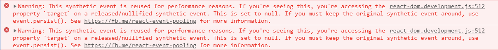
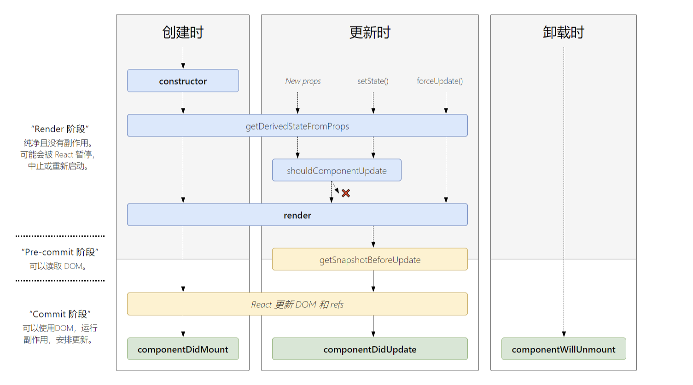

又踩到了一个坑，思考如下代码：

```jsx
import React from "react"
import ReactDOM from "react-dom"
class InputForm extends React.Component {
  constructor(props) {
    super(props)
    this.state = {
      value: "",
    }
  }
  onInputChange = evt => {
    this.setState((prev, props) => {
      // 可以正常运行吗？
      const {
        target: { value },
      } = evt
      return { value }
    })
  }
  render() {
    return (
      <form>
        <label htmlFor="name">Name:</label>
        <input type="text" name="name" value={this.state.value} onChange={this.onInputChange} />
        <input type="submit" value="submit" />
      </form>
    )
  }
}

ReactDOM.render(<InputForm />, document.querySelector("#root"))
```

这个例子来自官方文档，由于 React 官方推荐使用函数的方式来异步的修改 state。所以我将官方例子中的 setState 的参数改为了函数。结果得到了以下错误(官方文档，最为致命)：



错误的原因是说合成事件出于性能的考虑被重用了。所以接下来踩踩 React 事件系统这个坑。

# React 的事件系统

## 模拟事件系统

React 根据 W3C 的标准，创造出了属于 React 的 SyntheticEvent，当我们在 JSX 中编写诸如`onClick={xxx}`等事件绑定函数时，React 并不会真的给每个元素都绑定一个事件, 而是鸡贼的使用了事件代理的方式，在根节点`document`上为每种事件添加了唯一的监听函数。然后当事件冒泡到 document 上时，再根据 Event 的 target 属性，找到真正触发事件的元素。然后再去触发真正的监听函数。

从上可知，React 中通过 JSX 绑定的事件监听函数，一定比原生 JS 绑定的事件监听函数触发的慢。我们来验证一下这个结果。

<iframe width="100%" height="300" src="//jsfiddle.net/iwfan/gn6pezvx/embedded/" allowfullscreen="allowfullscreen" allowpaymentrequest frameborder="0"></iframe>

> vanilla 代表的是原生 JS 绑定的事件监听

点击 child 元素，会先弹出`vanilla on child click`,随后事件冒泡到 parent，然后弹出`vanilla on parent click`, 最后事件冒泡到 document 上弹出`vanilla on document click`。随后执行 JSX 添加在 document 上的另一个监听函数，依次输出`react on child click`和`React on parent click`。

一旦我们在原生的 document 点击监听函数中执行了`evt.stopImmediatePropagation()`, 那么事件就不会继续在 document 执行，从而也就不会触发 JSX 的监听函数了。

## 事件池

React 的合成事件是存放在事件池中共享的。查看如下示例：

<script async src="[//jsfiddle.net/iwfan/01tL9re3/embed/](https://jsfiddle.net/iwfan/01tL9re3/embed/)"></script>

在先点击 A 在点击 B 后， 查看控制台输出。可以发现两个元素的合成事件是相同的，而原生事件比较的结果却为 false。

而在执行`event.persist()`之后，React 会在事件池中删除合成事件，此后得到的结果就为 false 了。

# 生命周期



[原图地址](http://projects.wojtekmaj.pl/react-lifecycle-methods-diagram/)

新版的生命周期图

# DOM Diff

React 对 DOMDiff 算法的优化基于以下两个假设：

1. 相同的组件产生相同的 DOM 结构，不同的组件产生不同的 DOM 结构。
2. 对于同一层次的一组节点， 它们可以根据一个唯一的 id 进行区分。

## Virtual DOM 更新机制

以下这个例子来源于[深入浅出 React（四）：虚拟 DOM Diff 算法解析](http://www.infoq.com/cn/articles/react-dom-diff?utm_source=articles_about_dive-into-react&utm_medium=link&utm_campaign=dive-into-react)。

<script async src="//jsfiddle.net/iwfan/86qh91mr/embed/"></script>

与原文的区别是新版本的 React 会先创建出节点，随后才去移除原来的节点。

> React 只会对 DOM 树进行同一层级的节点比较。

1. 针对不同类型的节点，先删除旧的节点（并不会去比较子节点），然后插入新的节点。
2. 针对不同的属性节点，React 会重设节点的值。style 节点稍微不同，会对 style 对象的属性进行比较然后更新。
3. 针对列表节点，React 会根据设置的 key 进行比较。

# 参考资料

1. [React 事件代理与 stopImmediatePropagation](https://github.com/youngwind/blog/issues/107)
2. [深入浅出 React（四）：虚拟 DOM Diff 算法解析](http://www.infoq.com/cn/articles/react-dom-diff?utm_source=articles_about_dive-into-react&utm_medium=link&utm_campaign=dive-into-react)
