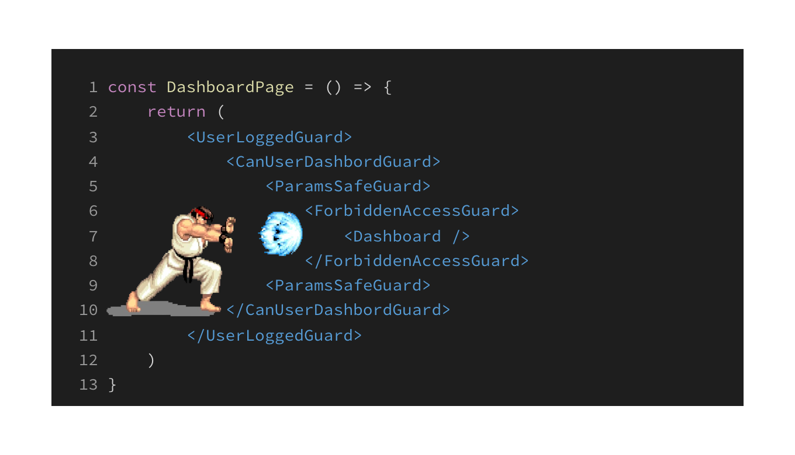

在服务端开发中，鉴权、认证、校验等业务规则检查是不可或缺的，但当这些代码与 Server Component 结合时，我们应该如何更优雅地处理呢？🤔

通常最简单的处理方式就是通过增加 IF/ELSE 控制流来完成业务规则检查。

```jsx
const DashboardPage = async () => {
  const isUserLoggedIn = await fetchUser()

  if (!isUserLoggedIn) {
    redirect("/login")
  }

  const canUseDashboard = await queryFeatureFlag("dashboard")

  if (!canUseDashboard) {
    redirect("/access-denied")
  }

  return <Dashboard />
}
```

但当业务规则检查越来越多的时候，更恰当的方式是使用 [Container Pattern](https://www.patterns.dev/react/presentational-container-pattern) ，通过分离关注点的方式，增强代码的可维护性。

```jsx
const UserLoggedGuard = async ({ children }) => {
  const isUserLoggedIn = await fetchUser()

  if (!isUserLoggedIn) {
    redirect("/login")
  }

  return children
}

const CanUserDashbordGuard = async ({ children }) => {
  const canUseDashboard = await queryFeatureFlag("dashboard")

  if (!canUseDashboard) {
    redirect("/access-denied")
  }

  return children
}

const DashboardPage = async () => {
  return (
    <UserLoggedGuard>
      <CanUserDashbordGuard>
        <Dashboard />
      </CanUserDashbordGuard>
    </UserLoggedGuard>
  )
}
```

但带来的另一个问题就是，一旦 Guard 组件过多，对业务组件 JSX 的侵入就变得很严重。

```jsx
const DashboardPage = () => {
	return (
		<UserLoggedGuard>
			<CanUserDashbordGuard>
				<ParamsSafeGuard>
					<ForbiddenAccessGuard>
						<Dashboard />
					</ForbiddenAccessGuard>
				<ParamsSafeGuard>
			</CanUserDashbordGuard>
		</UserLoggedGuard>
	)
}
```

看到上面的代码，你脑海里是否又响起了熟悉的“Hadoken!” 🫨

此时为了避免 Guard 组件对业务组件的侵入，在设计上可以考虑根据 Server Component 的特性把这些 Guard 抽离出来，变成这样：

```jsx
const DashboardPage = () => {
  return <Dashboard />
}

export default composeGuard(UserLoggedGuard, CanUserDashbordGuard, ParamsSafeGuard, ForbiddenAccessGuard, DashboardPage)
```

现在看起来 Dashboard 的业务代码是不是更干净了？Guard 组件也更集中，方便统一查看检查规则。

---

那 `composeGuard` 要如何实现呢？在 Server Component 体系下，每个 Guard 都是一个独立的 Server Component，也是一个个的异步函数。想要实现这个逻辑也非常简单，就是把一堆异步函数放在一起，按顺序执行。我们可以按照这样的思路来实现：

首先在 TS 中定义出来我们需要的类型：

```ts
export interface NextSCProps<
  Params extends NodeJS.Dict<string> = NodeJS.Dict<string>,
  SearchParams extends ParsedUrlQuery = ParsedUrlQuery
> {
  params: Params
  searchParams: SearchParams
}

export interface NextSC<
  Params extends NodeJS.Dict<string> = NodeJS.Dict<string>,
  SearchParams extends ParsedUrlQuery = ParsedUrlQuery
> {
  (props: NextSCProps<Params, SearchParams>): Promise<
    React.ComponentType<React.PropsWithChildren<NextSCProps<Params, SearchParams>>>
  >
}
```

之后再来实现 compose 函数：

```ts
const composeGuard = (...guards: NextSC[]): NextSC => {
  return async (props: NextSCProps) => {
    for (const currentRSC of guards) {
      return await currentRSC(props)
    }
  }
}
```

💂 `composeGuard` 现在的逻辑非常简单，就是生成一个新的 ServerComponent，然后在这个新生成的 Server Component 中逐个运行给定的 guard。

但是 Bug 🐛 也非常明显，因为我们直接 return 了第一个 guard，导致现在 `composeGuard` 的结果只会渲染出第一个 Component 💩。但我们期望的是 guard 在**业务规则检查通过之后就运行后面的 Guard**，直到所有的 guard 都运行完为止。这里我们可以参考 Next.js 中 [`notFound`](https://github.com/vercel/next.js/blob/c5b5b1e3a3d85d498770a974c250c864e8d2a761/packages/next/src/client/components/not-found.ts#L9) 和 [`redirect`](https://github.com/vercel/next.js/blob/c5b5b1e3a3d85d498770a974c250c864e8d2a761/packages/next/src/client/components/redirect.ts#L39) 的 API 设计，通过抛异常来明确程序行为。

这里我们先定义出 `NextGuardError`

```ts
class NextGuardError extends Error {}

export function nextGuard(): never {
  throw new NextGuardError("go to next guard")
}

export function isNextGuardError(error: any): error is NextGuardError {
  return error instanceof NextGuardError
}
```

之后再补全 `composeGuard` 的代码逻辑：

```ts
const composeGuard = (...guards: NextSC[]): NextSC => {
  return async (props: NextSCProps) => {
    for (const guard of guards) {
      try {
        return await guard(props)
      } catch (error) {
        if (isNextGuardError(error)) {
          continue
        }
        throw error
      }
    }
    return null // 这里也可以选择继续抛出异常
  }
}
```

至此，我们的 `composeGuard` 基本就已经写完了，使用起来也很简单。以`CanUserDashbordGuard` 为例：

```ts
const CanUserDashbordGuard = async ({ children }) => {
  const canUseDashboard = await queryFeatureFlag("dashboard")

  if (!canUseDashboard) {
    redirect("/access-denied")
  }

  nextGuard() // 逻辑检查通过之后，执行后续 guard
}
```

在业务逻辑检查中，如果不符合条件可以直接渲染 UI 告知用户，也可以使用 `notFound` 或者 `redirect` 跳转到其他的页面中。但逻辑检查通过之后，可以使用 `nextGuard` 继续执行后续的 guard。

---

回过头来再看一下之前的代码示例：

```jsx
const DashboardPage = () => {
  return <Dashboard />
}

export default composeGuard(UserLoggedGuard, CanUserDashbordGuard, ParamsSafeGuard, ForbiddenAccessGuard, DashboardPage)
```

现在用户打开 Dashboard 页面时，会顺序经过 `UserLoggedGuard`、`CanUserDashbordGuard`、`ParamsSafeGuard` 和 `ForbiddenAccessGuard`。 但这些 guard 全部运行结束之后就会进入到 `DashboardPage` 执行核心的业务逻辑。这样，通过 Server Component 守卫，我们能够更清晰、更优雅地组织和处理业务逻辑，使代码更易读、易维护。
