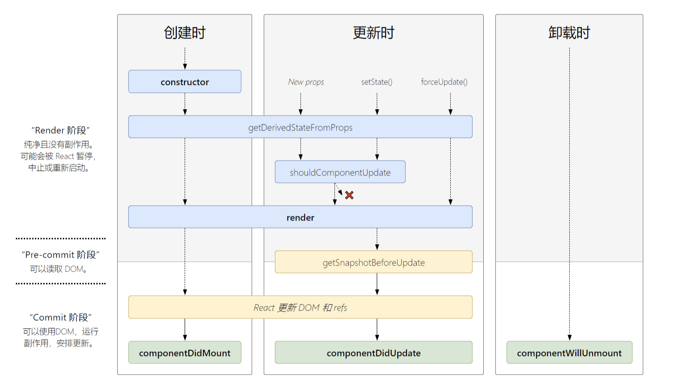

# 1.组件的生命周期

在 React 的这些概念中, 最重要的就是组件的生命周期了。 组件就像我们人一样，从出生到死亡, 这中间要从婴儿变为孩童再到青年、然后从青年人成长为中年人, 最后再到老年, 要经历好几个过程。 组件也有这样的过程, 但是不同于我们人类, 组件的经历的过程有点不同。他们的生命周期可以用下面这张图来表示。



[原图地址](http://projects.wojtekmaj.pl/react-lifecycle-methods-diagram/)

每个带有颜色的长方形表示 React 的一个生命周期函数(除了“React 更新 DOM 和 refs”)。竖着的三列表示生命周期的三个不同的阶段。

一个组件一次只能存在于一个阶段中，它在`创建时(mounting)`开始， 然后进入到 `更新时(updating)`。 然后组件就会一直存在于 `更新时`, 直到它被 Virtual DOM 移除。随后组件会进入`卸载时（unmounting）` 然后就被正真的 DOM Tree 移除了。

组件的生命周期函数允许我们在组件的不同生命周期执行我们特定的代码或者应对组件的变化。

**Mounting(创建时)**
在这个阶段， 基于 class 的组件会执行他们的 `constructor` 方法， 在 `constructor` 方法中你可以初始化组件的状态。
接下来， 组件将会执行 `static getDerivedStateFromProps` 方法, 我们先跳过这个方法， 因为它的作用很有限。
现在组件将会执行可以返回 JSX 的 `render` 方法。 然后 React 会将组件挂载到 DOM Tree。
最后， `componentDidMount` 将会执行， 你可以在这里执行一些异步任务例如获取数据库中的数据，或者你也可以直接操作 DOM。

**Updating(更新时)**
这个阶段会在每一次 state 或者 props 改变后触发。`static getDerivedStateFromProps`首先被执行, 与 Mounting 阶段不同的是这次没有`constructor`。
接下来 `shouldComponentUpdate` 执行，在这个方法中你可以比较旧的 state/props 与新的 state/props。你可以通过返回 true 或者 false 来决定你的组件需不需要重新渲染。这个方法可以帮助你省去不必要的渲染从而提升性能。 如果你返回 false 的话， 本次在更新阶段的生命周期就结束了。

如果你返回的是 true ，React 会重新执行 `render` 方法, 然后根据最新的 state/props 来重新渲染你的组件。随后 `getSnapshotBeforeUpdate` 执行，这个方法的作用也很有限(一般在这个方法中获取之前 DOM 的状态)。然后 React 会执行 `componentDidUpdate` 方法， 就像 `componentDidMount`一样， 你也可以在这个方法中做一些异步操作或者 DOM 操作。

**Unmounting(卸载时)**
所有美好的生活都有结束的一天。Ummounting 是组件生命周期的最后一个阶段。 当你从 DOM 树上将组件移除的时候， `componentWillUnmount`会在组件被移除之前执行。你应该使用这个方法清理打开的连接。 例如 websocket 和 timeout。

**其他的生命周期函数**
在进入下一个话题之前， 我们先来说说 `forceUpdate` 和 `static getDerivedStateFromError`。

`forceUpdate`是一个会直接导致组件重绘的方法。虽然在某些场景下可以使用， 但是一般情况下避免使用它。

`getDerivedStateFromError` 也是一个生命周期函数， 但它却不是生命周期的直接组成部分。当组件出现了错误， 这个方法会被执行， 你可以在这个方法中更新组件的状态来反映出错误信息。

理解 React 组件的生命周期与函数， 可以让你更准确的操作数据流和事件处理。

# 2.Higher-Order Components(高阶组件)

你或许已经使用过高阶组件(HOC)，例如 react-redux 中的 `connect`函数。但到底什么是 HOC 呢？
React 的文档上说:

> A higher-order component is a function that takes a component and returns a new component.

> 一个高阶组件就是一个函数， 它获取一个组件作为参数， 返回一个新的组件。

回到 Redux 的 connet 函数， 我们可以看到以下代码：

```javascript
const hoc = connect(state => state)
const WrappedComponent = hoc(SomeComponent)
```

connect 函数返回了一个 HOC ， 然后我们可以用这个 HOC 包裹我们的组件。 这里我们只需将组件传递给 HOC 并开始使用 HOC 返回的组件。

一个 HOC 的使用场景就是用户授权，你可以在每一个需要授权的组件中写你的权限校验代码。但这样会造成很多的重复，导致变成烂代码。

在没有 HOC 的情况下， 你可能会这样做授权：

```javascript
class RegularComponent extends React.Component {
  render() {
    if (this.props.isLoggedIn) {
      return <p>hi</p>
    }
    return <p>You're not logged in ☹️</p>
  }
}
// 重复代码!
class OtherRegularComponent extends React.Component {
  render() {
    if (this.props.isLoggedIn) {
      return <p>hi</p>
    }
    return <p>You're not logged in ☹️</p>
  }
}
// 我们需要给函数式组件提供不同的逻辑
const FunctionalComponent = ({ isLoggedIn }) => (isLoggedIn ? <p>Hi There</p> : <p>You're not logged in ☹️</p>)
```

你可以使用 HOC 来优化你的代码， 像下面这样：

```javascript
function AuthWrapper(WrappedComponent) {
  return class extends React.Component {
    render() {
      if (this.props.isLoggedIn) {
        return <WrappedComponent {...this.props} />
      }
      return <p>You're not logged in ☹️</p>
    }
  }
}

class RegularComponent extends React.Component {
  render() {
    return <p>hi</p>
  }
}
class OtherRegularComponent extends React.Component {
  render() {
    return <p>hello</p>
  }
}
const FunctionalComponent = () => <p>Hi There</p>

const WrappedOne = AuthWrapper(RegularComponent)
const WrappedTwo = AuthWrapper(OtherRegularComponent)
const WrappedThree = AuthWrapper(FunctionalComponent)
```

可以看到就算提供给组件授权的功能， 我们的组件也是非常简单的。`AuthWrapper`将全部的授权逻辑存放到一个统一的组件中。然后它根据一个叫做`isLoggedIn`的 props, 来判断是否返回`WrappedComponent` 还是返回 p 标签。

# 3.React State and setState()

大多数人可能都使用过 React 状态，我们甚至在 HOC 示例中使用过它。 但重要的是要了解当状态发生变化时，React 将触发对该组件的重新渲染(除非你在 shouldComponentUpdate 中返回了 false)。

现在让我们谈谈我们如何改变状态。 改变状态的唯一方法是通过 setState 方法。 此方法接受一个对象并将其合并到当前状态。除此之外，还有一些你应该知道的事情。

首先， setState 是异步的， 这意味着状态不会在你调用 setState 后立即被修改。这可能会导致一些不正确的行为，希望你能避免它。

```javascript
class App extends React.Component {
  constructor(props) {
    super(props)
    this.state = {
      counter: 0,
    }
  }
  onClick = () => {
    this.setState({ counter: this.state.counter + 1 })
    console.log(this.state.counter) // 0
  }
  render() {
    return <button onClick={this.onClick}>Click Me</button>
  }
}
```

> 0

在这个例子中， 我们调用 setState 方法之后，立即调用了 console.log。 我们的新的 counter 值*应该*是 1， 但是实际上却打印了 0。那么如果我们想在 setState 实际更新状态后访问新状态呢？

这让我们了解了我们应该了解的关于 setState 的下一条知识，即它可以采用回调函数。 我们来修复我们的代码！

```javascript
class App extends React.Component {
  constructor(props) {
    super(props)
    this.state = {
      counter: 0,
    }
  }
  onClick = () => {
    this.setState({ counter: this.state.counter + 1 }, () => {
      console.log("callback: " + this.state.counter) // 1
    })
    console.log("after: " + this.state.counter) // 0
  }
  render() {
    return <button onClick={this.onClick}>Click Me</button>
  }
}
```

> "after: 0"
> "callback: 1"

很好， 它生效了， 但是这样做真的对吗？ 不完全对， 我们实际上没有正确使用 setState 这个方法， setState 除了接受一个对象， 我们还可以传递一个函数给它。
这种模式一般使用在**你想根据旧的状态去设置新的状态**。如果你不想根据旧状态来决定新状态， 你可以随意传递对象给它。

```javascript
class App extends React.Component {
  constructor(props) {
    super(props)
    this.state = {
      counter: 0,
    }
  }
  onClick = () => {
    this.setState(
      (prevState, props) => {
        return { counter: prevState.counter + 1 }
      },
      () => {
        console.log("callback: " + this.state.counter) // 1
      }
    )
    console.log("after: " + this.state.counter) // 0
  }
  render() {
    return <button onClick={this.onClick}>Click Me</button>
  }
}
```

> "after: 0"
> "callback: 1"

但是传递函数而不是传递对象的根本区别是什么呢? 因为 setState 是异步的， 传递对象所创建的新状态可能是不正确的。 比如 在 setState 执行时， 另一个 setState 也可以修改状态。 而传递函数给了我们两个好处， 第一个是它给了我们一个永远也不会改变的基于当前状态的 static copy。第二点是 React 会将传递进来的函数放入队列中，让他们按照顺序执行。

看下面这个例子， 我们连续调用了两次 setState 让 counter 增加 2。

```javascript
class App extends React.Component {
  constructor(props) {
    super(props)
    this.state = {
      counter: 0,
    }
  }
  onClick = () => {
    this.setState({ counter: this.state.counter + 1 })
    this.setState({ counter: this.state.counter + 1 })
  }
  render() {
    console.log(this.state.counter)
    return <button onClick={this.onClick}>Click Me</button>
  }
}
```

> 1

React 会给 setState 做“节流”， 合并 setStae 传递的对象, 从而使得多个 setState 的行为只会产生一次更新的操作。 所以最后的结果是 1。

```javascript
class App extends React.Component {
  constructor(props) {
    super(props)
    this.state = {
      counter: 0,
    }
  }
  onClick = () => {
    this.setState(prevState => ({ counter: prevState.counter + 1 }))
    this.setState(prevState => ({ counter: prevState.counter + 1 }))
  }
  render() {
    console.log(this.state.counter)
    return <button onClick={this.onClick}>Click Me</button>
  }
}
```

> 2

这个例子中， 我们给 setState 传递了确保会顺序执行的函数，初次之外，它获取到的是当前状态的一个快照而不是直接用的当前尚未更新的状态, 现在输出了正确的结果 2 。

# 4.React Context

React Context API 允许你创建一个“全局”的对象，你可以将这个对象传递给任意一个你创建的组件。Context API 可以无需使用 props 就可以实现状态共享。

如何使用 context 呢？

首先需要创建一个 context 对象：

```javascript
const ContextObject = React.createContext({ foo: "bar" })
```

然后给组件设置 context：

```javascript
MyClass.contextType = MyContext
```

然而在 React 16.4.2 这是不会生效的，我们可以用 Dan Abramov 推荐的方式用 HOC 去使用 context。

```javascript
function contextWrapper(WrappedComponent, Context) {
  return class extends React.Component {
    render() {
      return <Context.Consumer>{context => <WrappedComponent context={context} {...this.props} />}</Context.Consumer>
    }
  }
}
```

我们用 `Context.Consumer` 组件包裹了我们的组件， 然后使用 props 传递了 context 。

然后我们可以这样使用这个 HOC:

```javascript
class Child extends React.Component {
  render() {
    console.log(this.props.context)
    return <div>Child</div>
  }
}
const ChildWithContext = contextWrapper(Child, AppContext)
```

我们成功的从 context 上访问到了 `foo`。

你可能会问我们如何修改 context 呢？这可能有一点复杂， 不过我们可以再一次使用 HOC 来实现。

```javascript
function contextProviderWrapper(WrappedComponent, Context, initialContext) {
  return class extends React.Component {
    constructor(props) {
      super(props)
      this.state = { ...initialContext }
    }

    // 在这里定义如何去修改context
    changeContext = () => {
      this.setState({ foo: "baz" })
    }

    render() {
      return (
        <Context.Provider
          value={{
            ...this.state,
            changeContext: this.changeContext,
          }}>
          <WrappedComponent />
        </Context.Provider>
      )
    }
  }
}
```

首先我们拿到了传递给`React.createContext`的初始的 context 值, 然后把它作为我们 wrapperComponent 的状态。 然后我们定义了一个 changeContext 的方法, 用来修改 context 的值。最后我们用 `Context.Provider` 包裹我们的组件， 然后将当前的状态和函数都作为 props 传递给它。现在任何被`Context.Consumer`包裹的组件都可以访问到他们。

然后把所有的东西都放在一起。

```javascript
const initialContext = { foo: "bar" }
const AppContext = React.createContext(initialContext)

class Child extends React.Component {
  render() {
    return (
      <div>
        <button onClick={this.props.context.changeContext}>Click</button>
        {this.props.context.foo}
      </div>
    )
  }
}

const ChildWithContext = contextConsumerWrapper(Child, AppContext)
const ChildWithProvide = contextProviderWrapper(ChildWithContext, AppContext, initialContext)

class App extends React.Component {
  render() {
    return <ChildWithProvide />
  }
}
```

现在我们的子组件可以不但可以访问到全局的 context， 可以对它做出一些修改。

# 5.及时了解 React

最后一个概念可能是最容易理解的。 它只是跟上最新版本的 React。 React 最近发生了一系列的变化，它还会继续增长和发展。
例如: 在 React 16.3 某些生命周期函数被废弃了， 在 React 16.6 中， 推出了新的 [async component](https://reactjs.org/docs/code-splitting.html#reactlazy),在 React 16.7 中又推出了[hooks](https://reactjs.org/docs/hooks-intro.html), 它可以完全取代基于 class 的组件。
