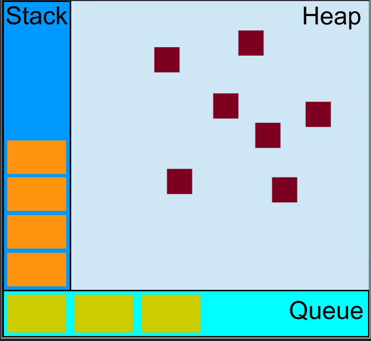
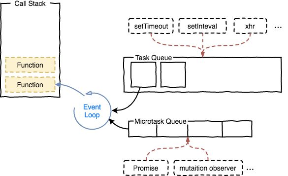

最近遇到了这样一个题目：

```jsx
console.log(1)

setTimeout(function () {
  console.log(2)
})

var promise = function () {
  return new Promise(function (resolve, reject) {
    console.log(3)
    setTimeout(function () {
      resolve(5)
    }, 0)
    console.log(4)
  })
}

promise()
  .then(function (data) {
    console.log(data)
    return Promise.resolve(6)
  })
  .then(function (data) {
    console.log(data)
  })

console.log(7)
```

请问以上代码的输出顺序是什么？

- 点击此处查看答案

  答案是：`1`、`3`、`4`、`7`、`2`、`5`、`6`

# 为什么会这样

如果你想理解为什么会是这样，你需要对 JS 中的`Event Loop`有一点了解。并且需要知道 Event Loop 是如何处理宏任务(`macro task`)与微任务(`micro task`)的。

> Event Loop 是什么东西？ 为什么 JS 需要它？



上图为 Event Loop 的可视化模型图，Event Loop 就是 JS 的运行机制，它的一大特点就是永不阻塞。众所周知，JS 是一门单线程的语言，就是说 JS 在执行任何代码的时候，都只有一个主线程来处理所有的任务。如果没有 Event Loop，那么页面在加载图片的时候，就不能继续加载其他的 DOM 元素，导致网页卡顿。图中 Stack 指的是 JS 的调用栈， Heap 是堆，Queue 表示队列， Event Loop 一直在运行，处理队列中的任务，而一个 Event Loop 可以有多个任务队列。

# 宏任务与微任务

上面说到 Event Loop 可以有多个任务队列，那么为什么会有多个队列呢？因为如果有多个队列的话，就可以让 Event Loop 选择性的执行某个队列中的内容，这样就可以优先处理性能敏感的任务， 比如用户输入。
因为执行优先级的不同，那么任务就被分为两类：宏任务(`macro task`)与微任务(`micro task`)。

属于宏任务的有： `script(整体代码)`、`setTimeout/setInterval`、`I/O(例如图片、视频的加载)`、`UI交互(用户的点击事件)与渲染`
属于微任务的是： `process.nextTick`、`Promise`、`MutaionObserver`、`Object.observer`

下图为基本的 Event Loop 运行过程(图片来自[知乎](https://zhuanlan.zhihu.com/p/33087629))



Event Loop 执行时，先从`Macrotask Queue(Task Queue)`中拉出一个 task 执行， 该 task 执行完毕之后， 首先检查`Microtask Queue`中是否存在 task，如果存在 task，那么就依次执行`Microtask queue`中的 task 直至队列清空，否则继续执行`macrotask queue`中的下一个 task。按此顺序循环执行。

# 观察代码

知道了上述内容之后，回过头来继续看文章开头的代码， 分析执行顺序。

```
console.log(1);

setTimeout(function () {
  console.log(2);
}, 0);

var promise = function () {
  return new Promise(function (resolve, reject) {
    console.log(3);
    setTimeout(function () {
      resolve(5);
    }, 0);
    console.log(4);
  });
};

promise()
  .then(function (data) {
    console.log(data);
    return Promise.resolve(6);
  })
  .then(function (data) {
    console.log(data);
  });

console.log(7);

```

首先在代码开始执行时，将全部的 js 代码放入`macrotask queue`中， Event Loop 将 **第一个** macro task 压入`全局的执行栈`中执行，所以首先会输出:

> 1

然后继续往下执行， 遇到了`setTimeout`, 由于 setTimeout 属于`macro task`, 所以在经过 0ms 后，将回调函数推进`macrotask queue`中， 此时`macrotask queue`存在两个任务。

> setTimeout 这个函数，是经过指定时间后，把要执行的任务加入到 macrotask queue 中

继续执行， 又遇到了 promise，`new Promise` 中的函数会立即执行，于是输出了：

> 3

然后又遇到了一个 setTimeout，将它推入`macrotask queue`队列, 此时该队列中存在三个任务。
然后又紧接着输出了：

> 4

然后再往下遇到了 Promise 的 then 函数，他们属于`micro task`, 所以将他们推入`microtask queue`中。这里只推入了第一个 then，此时的`microtask queue`中只有一个任务。

然后继续执行输出了：

> 7

然后第一个宏任务就执行完毕，此时去检查`microtask queue`,此时的微任务队列中只有一个 promise 的 then 函数回调， 但是此时的 Promise 还是 pending 状态，所以此回调暂时无法执行， 跳过。 继续下一个宏任务。

执行第二个宏任务， 此时输出了：

> 2

继续检查微任务队列， 此时 Promise 的状态还是 pending， 继续下一个宏任务。
执行第三个宏任务， 将 Promise 的状态改为 fulfilled

检查微任务队列，此时 Promise 的状态变为 fulfilled， 执行第一个微任务
输出：

> 5

然后执行 Promise.resolve(6), 执行 then，将回调推入 `microtask queue`,
然后执行微任务队列， 最后输出：

> 6

# 写在最后

通过本文对 JS 的执行机制有了一个简单的了解，知道了`宏任务`与`微任务`这两个任务分类，并且知道 Event Loop 执行宏任务与微任务的过程。

# 参考资料

1. https://jakearchibald.com/2015/tasks-microtasks-queues-and-schedules/
2. https://zhuanlan.zhihu.com/p/33058983
3. https://zhuanlan.zhihu.com/p/33087629
4. https://www.zhihu.com/question/36972010
5. https://juejin.im/post/59e85eebf265da430d571f89
